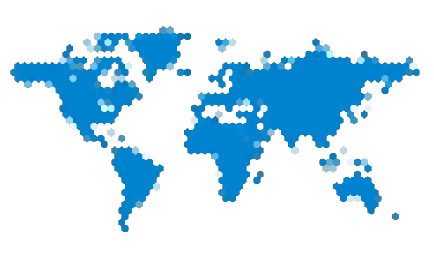

Free README.md-Template from [Best-README-Template](https://github.com/othneildrew/Best-README-Template/)

# The README.md is actual under WIP
   
<div id="top"></div>
<!--
*** Thanks for checking out the Best-README-Template. If you have a suggestion
*** that would make this better, please fork the repo and create a pull request
*** or simply open an issue with the tag "enhancement".
*** Don't forget to give the project a star!
*** Thanks again! Now go create something AMAZING! :D
-->


<!-- PROJECT SHIELDS -->
<!--
*** I'm using markdown "reference style" links for readability.
*** Reference links are enclosed in brackets [ ] instead of parentheses ( ).
*** See the bottom of this document for the declaration of the reference variables
*** for contributors-url, forks-url, etc. This is an optional, concise syntax you may use.
*** https://www.markdownguide.org/basic-syntax/#reference-style-links
-->
[![Contributors][contributors-shield]][contributors-url]
[![Forks][forks-shield]][forks-url]
[![Stargazers][stars-shield]][stars-url]
[![Issues][issues-shield]][issues-url]
[![MIT License][license-shield]][license-url]
[![LinkedIn][linkedin-shield]][linkedin-url]


<!-- PROJECT LOGO -->
<br />
<div align="center">
  <a href="https://github.com/AnnoDomine/dominic-seel_de">
    
  </a>

<h3 align="center">dominic-seel.de - MicroPage Back- & FrontEnd</h3>

  <p align="center">
    Development-Project of my MicroPage.
    <br />
    <a href="https://github.com/AnnoDomine/dominic-seel_de"><strong>Explore the docs »</strong></a>
    <br />
    <br />
    <!--a href="https://github.com/AnnoDomine/dominic-seel_de">View Demo</a>
    ·-->
    <a href="https://github.com/AnnoDomine/dominic-seel_de/issues">Report Bug</a>
    ·
    <a href="https://github.com/AnnoDomine/dominic-seel_de/issues">Request Feature</a>
  </p>
</div>


<!-- TABLE OF CONTENTS -->
<details>
  <summary>Table of Contents</summary>
  <ol>
    <li>
      <a href="#about-the-project">About The Project</a>
      <ul>
        <li><a href="#built-with">Built With</a></li>
      </ul>
    </li>
    <li>
      <a href="#getting-started">Getting Started</a>
      <ul>
        <li><a href="#installation">Installation</a></li>
      </ul>
    </li>
    <li><a href="#usage">Usage</a></li>
    <li><a href="#roadmap">Roadmap</a></li>
    <li><a href="#contributing">Contributing</a></li>
    <li><a href="#license">License</a></li>
    <li><a href="#contact">Contact</a></li>
    <li><a href="#acknowledgments">Acknowledgments</a></li>
  </ol>
</details>


<!-- ABOUT THE PROJECT -->
## About The Project

The project is a personal self-education in development to build my MicroPage.

The design as planed is a spinable globus in hex-dot-design with clickable dots as a menue.

Hope the picture in my head getting real ;)

<!--[![Product Name Screen Shot][product-screenshot]](https://example.com)-->

<p align="right">(<a href="#top">back to top</a>)</p>


### Built With

* [Visual Studio Code](https://code.visualstudio.com/)
* [Node.js](https://nodejs.org/)
* [React.js & ReactDOM](https://reactjs.org/)

<!--
* [Next.js](https://nextjs.org/)
* [Vue.js](https://vuejs.org/)
* [Angular](https://angular.io/)
* [Svelte](https://svelte.dev/)
* [Laravel](https://laravel.com)
* [Bootstrap](https://getbootstrap.com)
* [JQuery](https://jquery.com)
-->

<p align="right">(<a href="#top">back to top</a>)</p>

<!-- GETTING STARTED -->
## Getting Started

Just 'fork' and push the project.
### Installation

1. Give the project a 'star' and a 'fork'
2. Clone the repo
   ```sh
   git clone https://github.com/AnnoDomine/dominic-seel_de.git
   ```
3. 
```
npm install
```
to install all modules and initate to begin
4. Have fun and happy hacking

<p align="right">(<a href="#top">back to top</a>)</p>

<!-- USAGE EXAMPLES -->
## Usage

Download and use it as an exaple or education made by the GitHub-Community.
If you publish youre work with this included i would be happy if you write the repo-link to ref the project.

<p align="right">(<a href="#top">back to top</a>)</p>


<!-- ROADMAP -->
## Roadmap

- [X] Concept
- [ ] Build the FrontPage
- [ ] Get inspiration :D

See the [open issues](https://github.com/AnnoDomine/dominic-seel_de/issues) for a full list of proposed features (and known issues).

<p align="right">(<a href="#top">back to top</a>)</p>


<!-- CONTRIBUTING -->
## Contributing

Contributions are what make the open source community such an amazing place to learn, inspire, and create. Any contributions you make are **greatly appreciated**.

If you have a suggestion that would make this better, please fork the repo and create a pull request. You can also simply open an issue with the tag "enhancement".
Don't forget to give the project a star! Thanks again!

1. Fork the Project
2. Create your Feature Branch (`git checkout -b feature/AmazingFeature`)
3. Commit your Changes (`git commit -m 'Add some AmazingFeature'`)
4. Push to the Branch (`git push origin feature/AmazingFeature`)
5. Open a Pull Request

<p align="right">(<a href="#top">back to top</a>)</p>


<!-- LICENSE -->
## License

Distributed under the MIT License. See `LICENSE.txt` for more information.

<p align="right">(<a href="#top">back to top</a>)</p>


<!-- CONTACT -->
## Contact

[@DominicSebSeel][linkedin-url] - admin@dominic-seel.de

Project Link: [https://github.com/AnnoDomine/dominic-seel_de](https://github.com/AnnoDomine/dominic-seel_de)

<p align="right">(<a href="#top">back to top</a>)</p>


<!-- ACKNOWLEDGMENTS -->
## Devs that worked on this project

* [Dominic Seel](https://github.com/AnnoDomine)
* []()
* []()

<p align="right">(<a href="#top">back to top</a>)</p>


<!-- MARKDOWN LINKS & IMAGES -->
<!-- https://www.markdownguide.org/basic-syntax/#reference-style-links -->
[contributors-shield]: https://img.shields.io/github/contributors/AnnoDomine/dominic-seel_de.svg?style=for-the-badge
[contributors-url]: https://github.com/AnnoDomine/dominic-seel_de/graphs/contributors
[forks-shield]: https://img.shields.io/github/forks/AnnoDomine/dominic-seel_de.svg?style=for-the-badge
[forks-url]: https://github.com/AnnoDomine/dominic-seel_de/network/members
[stars-shield]: https://img.shields.io/github/stars/AnnoDomine/dominic-seel_de.svg?style=for-the-badge
[stars-url]: https://github.com/AnnoDomine/dominic-seel_de/stargazers
[issues-shield]: https://img.shields.io/github/issues/AnnoDomine/dominic-seel_de.svg?style=for-the-badge
[issues-url]: https://github.com/AnnoDomine/dominic-seel_de/issues
[license-shield]: https://img.shields.io/github/license/AnnoDomine/dominic-seel_de.svg?style=for-the-badge
[license-url]: https://github.com/AnnoDomine/dominic-seel_de/blob/master/LICENSE.txt
[linkedin-shield]: https://img.shields.io/badge/-LinkedIn-black.svg?style=for-the-badge&logo=linkedin&colorB=555
[linkedin-url]: https://linkedin.com/in/dominic-seel
[product-screenshot]: images/screenshot.png
© 2021 GitHub, Inc.
Terms
Privacy
Security
Status
Docs
Contact GitHub
Pricing
API
Training
Blog
About
